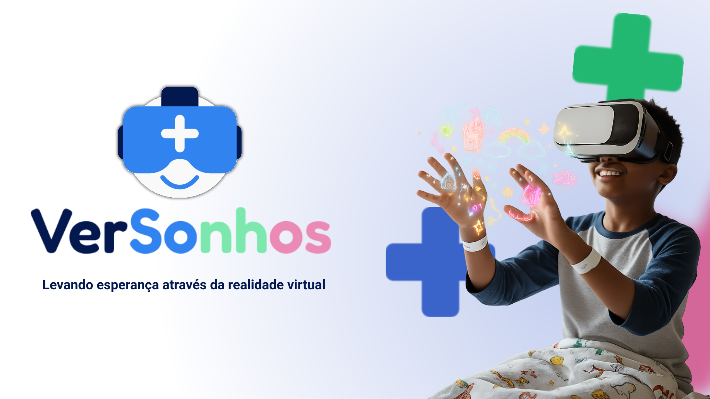

# 🌈 VerSonhos  
### _Realidades que curam, emoções que transformam._

> 🕶️ **Tecnologia que acolhe. 💙 Esperança que transforma.**

> **VerSonhos** leva experiências imersivas em **realidade virtual** para crianças hospitalizadas, criando momentos de **alegria, aprendizado e esperança** durante o tratamento.

---

---

## 🎯 Missão  
Levar **alegria, aprendizado e esperança** às crianças hospitalizadas por meio da **realidade virtual**, complementando o cuidado dos profissionais de saúde e tornando o tratamento mais leve e humano.  

---

## 👁️ Visão  
Ser referência em **inovação e humanização hospitalar**, usando tecnologia para transformar a experiência de internação infantil.

---

## 💙 Nossos Valores  
✨ **Empatia** — cuidar com o coração  
💡 **Inovação** — usar tecnologia para o bem  
🌍 **Acessibilidade** — todos merecem sonhar  
🌈 **Esperança** — reacender sorrisos  

---

## 🧩 O que fazemos  
Com **óculos de realidade virtual**, levamos o mundo até o leito das crianças:  
- 🐠 Aventuras e explorações virtuais  
- 🎮 Jogos que reduzem o estresse e a dor  
- 🧘 Experiências relaxantes e educativas  

---

## 🏥 Para quem é  
👧 **Crianças hospitalizadas** — em tratamento ou recuperação  
👩‍👦 **Famílias** — que buscam conforto e esperança  
👨‍⚕️ **Profissionais de saúde** — que acreditam em um cuidado mais humano  

---

## 👥 Nossa Equipe  
| Nome | Função |
|------|--------|
| **Heitor Sales** | PO, Financeiro e Desenvolvedor Full Stack |
| **João Pedro** | Scrum Master e Front-End |
| **Vitor Mota** | Designer, Front-End e Marketing |
| **Nicolas Coelho** | Desenvolvedor Full Stack |
| **Mariana Ocireu** | Desenvolvedora Full Stack |
| **Maurício** | UX/UI e Design de Interface |

---

## 💫 Como você pode ajudar  
💸 **Doe** — contribua financeiramente ou com equipamentos  
📢 **Divulgue** — compartilhe nossa missão nas redes  
🌐 **Acesse tudo em um só lugar:** [linktr.ee/versonhos](https://linktr.ee/versonhos)

📧 **Contato:** [contato@versonhos.com.br](mailto:contato@versonhos.com.br)  
🌐 **Site:** [versonhos.com.br](https://versonhos.com.br) *(em desenvolvimento)*  
📍 **Local:** São Paulo, SP – Brasil  

---

> _“Nós não tiramos a criança do hospital — levamos o mundo até ela.”_

---

  Feito com 💙 por toda a equipe da <strong>VerSonhos</strong>

